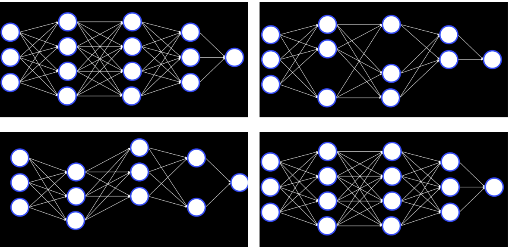
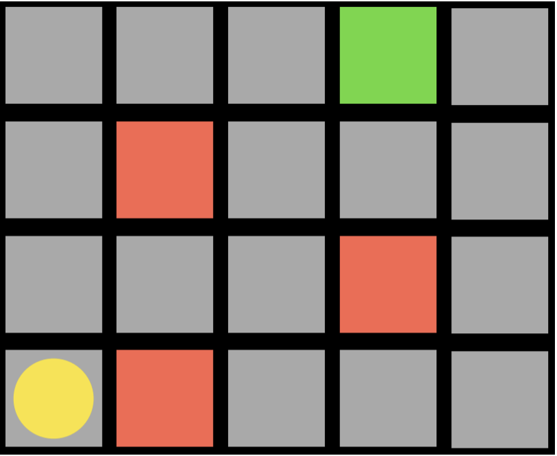
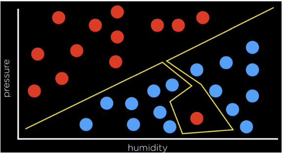
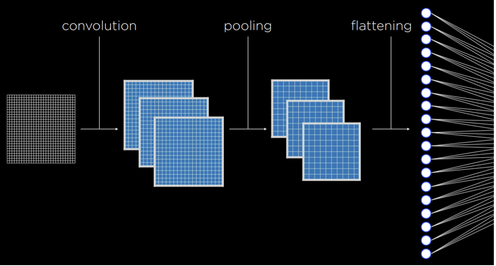

# CS50AI: Projects from Harvard's Introduction to Artificial Intelligence with Python

Welcome to my repository showcasing all the projects I completed during **Harvard's Introduction to Artificial Intelligence with Python**. This course provided an amazing introduction to A.I. concepts, and I’m proud to share my work here.

### About This Repository
- These projects represent my journey through the course, applying core A.I. principles and Python programming to solve real-world problems.
- To demonstrate my completion of the course, I’ve included my **verified certificate**.

### Note to Visitors
This repository is intended for **prospective employers** and anyone curious about my A.I. journey. If you’re still completing the course, I recommend not using this repository as a reference to avoid spoilers.

Feel free to explore, and I’m always open to feedback or collaboration opportunities. Thanks for stopping by!

Best,  
**Daniel Gray**
## Just some highlights from the class. Which is free. Take it! 
### Markov Decision Processes: 
The agent is the yellow circle, and it needs to get to the green square while avoiding the red squares. Every single square in the task is a state. Moving up, down, or to the sides is an action. The transition model gives us the new state after performing an action, and the reward function is what kind of feedback the agent gets. For example, if the agent chooses to go right, it will step on a red square and get negative feedback. This means that the agent will learn that, when in the state of being in the bottom-left square, it should avoid going right. This way, the agent will start exploring the space, learning which state-action pairs it should avoid. 

### Overfitting: 
Overfitting is when a model fits the training data so well that it fails to generalize to other data sets. In this sense, loss functions are a double edged sword. In the example below, the loss function is minimized such that the loss is equal to 0. However, it is unlikely that it will fit new data well.

### and check out this covulutional nueral net!  
This course does a great job of making neural nets easy to understand. They start you off with a small one and then introduce things like this:

A convolutional neural network is a neural network that uses convolution, usually for analyzing images. It starts by applying filters that can help distill some features of the image using different kernels. These filters can be improved in the same way as other weights in the neural network, by adjusting their kernels based on the error of the output. Then, the resulting images are pooled, after which the pixels are fed to a traditional neural network as inputs (a process called flattening).

